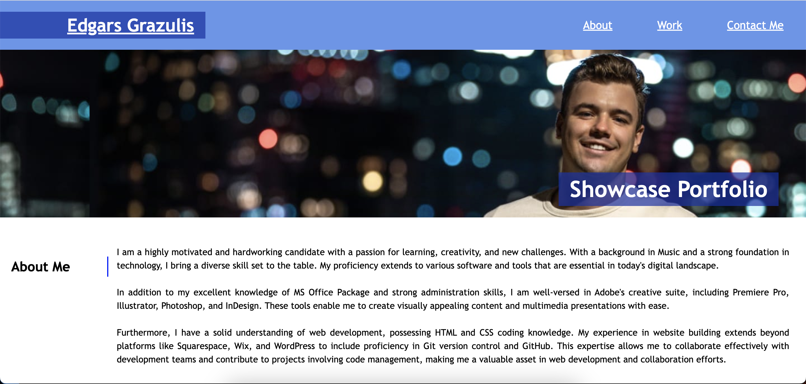

# Edgars-Showcase-Portfolio

## Description

Second challenge - Edgars Showcase Portfolio. The challenge begins with a minimal to none starter code and later is modified to make the website more accessible and viewer friendly. Below I'd like to list some of the things I've changed:

HTML:

1. Changed pages title
2. Adjusted header and nav bar with links that lead to appropriate destinations
3. Added main portrait photo
4. Added a brief biography to "About Me" portion of the page
5. "Work" section entitles a link to the first challenge as well as links to future projects
6. Supplemented "Contact" section with appropriate links so that the visitor can contact me if necessary

Additionally to above, I've also changed CSS properties,

CSS:

1. I've used display:flex for header and nav bar
2. Changed font-colors for base, hover and visited properties
3. Added the main portrait and adjusted its settings and position
4. "About Me" section uses display: flex with flex:1 for h2 and flex:7 for page article. The text-alignement is justified.
5. Hero banner "Showcase Portfolio" uses absolute position and is moved to the right
6. "Work" section again uses display: flex with flex:1 for h2 and flex:7 for work grid. Then within this flexbox a grid is implemented to achieve starter alike looks.
   Background images are added and adjusted.
7. I didn't succeed in adding links to the pictures, but I managed to get links to grids headlines. Those links are functional and leads to my finished and upcoming projects
8. "Contact Me" section is styled using flex properties.
9. Lastly viewport @media screen settings are added to make website accessible on any device.

## Comments

I did find this challenge extremely hard as we received a little to none starter code and had to build the site from 0. Throughout the bilding process I referred back to the materials we covered in the provious week. Additionally, I used http://w3schools.com/ https://developer.mozilla.org/en-US/ and bootcampspot (including presentations) resources, especially while working with CSS to make sure website looks the way it looks.

## Link

https://grazulisedgars.github.io/Edgars-Showcase-Portfolio/

## Screenshot

## License

MIT
